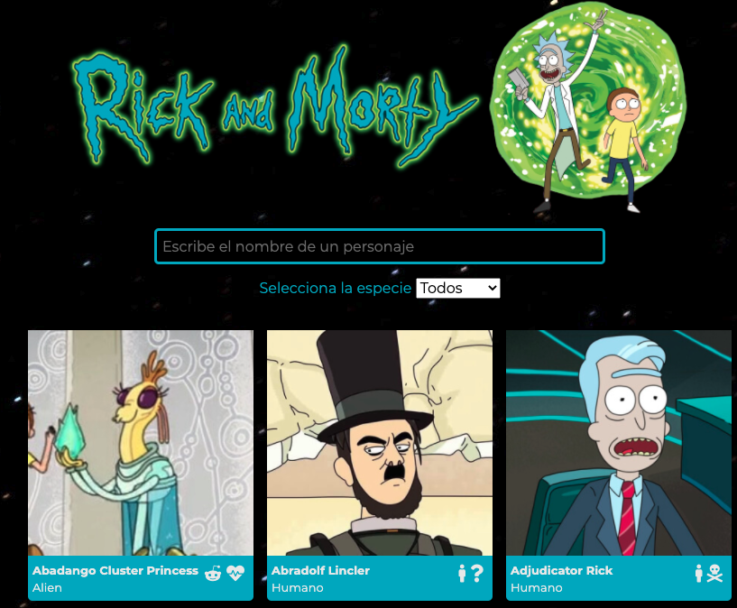
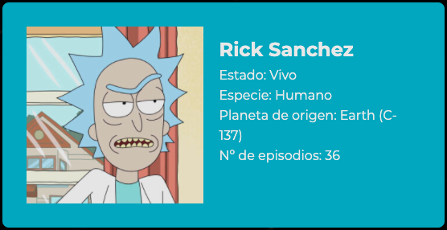
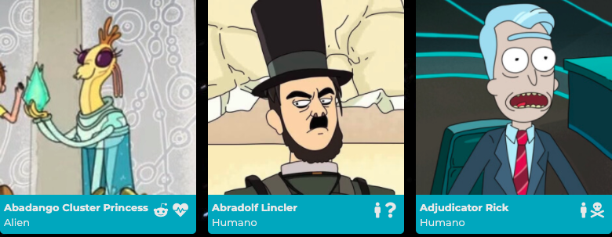

# Buscador de personajes de **Rick & Morty** 




Esta aplicación web es una **web de búsqueda de personajes** de la serie **Rick & Morty**, con la que el usuario puede buscar un personaje por su nombre, así como filtrando por la especie. Al seleccionar el personaje, aparecerá una tarjeta con más información acerca del mismo.

A continuación trataré de explicar más detalladamente:

1. Tecnologías utilizadas.
2. Algunas funcionalidades extra.
3. Cómo arrancar el proyecto.

## Tecnologías utilizadas

### Node JS y NPM

```
/
|
|- node_modules
|   |- react
|   |- react-dom
|   |- react-router
|
|– public
|   |– index.html   
|
|– src
|   |– images
|   |– stylesheets
|      |– components
|      |– core
|      |– components
|      |– layout
|      |– App.scss
|   |– components
|      |– App.js
|      |– CharacterCard.js
|      |– CharacterDetail.js
|      |– CharacterList.js
|      |– Filters.js
|      |– Header.js
|   |– services
|      |– api.js
|      |– api.test.js
|   |– index.js
|   |– index.scss
|
|– .gitignore
|
|
|– package.json // project info + dependencies

```

Este proyecto ha sido llevado a cabo utilizando React, en el que he tratado de trabajar con una estructura bien organizada con node y npm. Npm instalará las dependencias en la carpeta `node_modules`, de donde podremos importar módulos de JS como `react`, `react-dom` y `react-router` a nuestro código.

El código se agrupa dentro de la carpeta `src`, excepto el único archivo HTML que usaremos, que estará en `public/index.html`. Los componentes de React irán en la carpeta `src/components`, cada uno en su fichero.

## 2. React

Para la parte de React, he creado los componentes: 
```
|   |– components
|      |– App.js
|      |– CharacterCard.js
|      |– CharacterDetail.js
|      |– CharacterList.js
|      |– Filters.js
|      |– Header.js
```
El componente `App.js`es el que engloba la mayor parte de la lógica de la aplicación y desde el que se *llaman* al resto de componentes de la aplicación.

El componente CharacterCard es el que se encarga de *pintar* la carta de cada personaje, que luego será importada a CharacterList y a través de este componente se devolverá un listado con cada una de las cartas de los personajes, cuya información recibimos de la llamada a la Api.

El componente CharacterDetail es el que recoge una información más detallada sobre cada personaje y aparece en pantalla cuando hacemos click sobre uno de ellos.

### Algunos extras

#### Más personajes, promesas en paralelo.

Lo que se pedía en este ejercicio era realizar una web con el listado de personajes, utilizando una Api que nos devuelve información sobre los 20 primeros personajes de la serie. Sobre cada uno, teníamos que pintar al menos: 
- Foto
- Nombre
- Especie

Me di cuenta de que la información de la Api estaba paginada, por lo que en la primera página se encontraba la información de 20 personajes, pero había unos cuantos más (hasta unas 30 páginas). Traté de averiguar cómo hacer para obtener más personajes tras la llamada a la API y lo implementé uniendo el resultado de diferentes promesas.
Al realizar varias peticiones veía que tardaba más en cargar los personasjes y probé con `await Promise.all`para realizar las llamadas al servidor en paralelo.


>```js
>const getDataFromApi = async () => {
>  const promisesResult = await Promise.all([
>    fetchCharacters('https://rickandmortyapi.>com/api/character/'),
>    fetchCharacters('https://rickandmortyapi.>com/api/character/?page=2'),
>    fetchCharacters('https://rickandmortyapi.>com/api/character/?page=3'),
>  ]);
>
>  return [].concat(...promisesResult);
>};
>
>```

#### Tests de la API

Asimismo y sólo con el objetivo de practicar, incluí unos test en la parte del API.

Ver [api.test.js](./src/services/api.test.js)

Tuve un problema con el `export default` porque `jest` no lo reconocía y puse `module.exports` pero `run docs` no funcionaba correctamente.

#### Filtrado por especie

Por otra parte, a la hora de filtrar los personajes, se pedía poder buscar por nombre. En mi caso, además he añadido la opción de que puedan filtrarse por especie.


#### Traducción de la información

En cuanto al detalle de los personajes, se pedía que al hacer click sobre la tarjeta de uno de ellos, su información apareciera a pantalla completa; utilizando para ello rutas y React router. En la pantalla de detalle tenía que aperecer, además de la foto, nombre y especie, el plantea de origen, el número de episodios en los que aparece y si está vivo o muerto. Para mantener el formato general de la página, en el que los mensajes y textos aparecen en español, traduje la información recibida de la Api para que en el detalle del personaje también apareciera en español.



#### Iconos de los personasjes

Hice que en la tarjeta de los personajes apareciera con un icono, tanto la especie como el estado (si está vivo, muerto, o situación desconocida) de un personaje.



## Cómo arrancar el proyecto

Nos clonamos el repositorio y ejecutamos en la terminal `npm install`para cargar las dependencias que necesitamos para trabajar con el proyecto.


